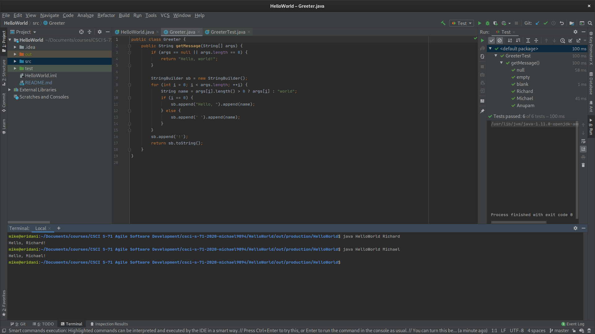

Set up your development environment
===================================

Repository
----------
URL: [https://github.com/Michael9094/csci-s-71-2020-michael9094](https://github.com/Michael9094/csci-s-71-2020-michael9094)

Score
-----
I hope to get a score of 11 out of 11.

Strengths
---------
I met the main objective of the assignment:

I used IntelliJ IDEA Ultimate edition to write and run a Java program that takes a command line argument, and shared the code here on GitHub.

The aspect of my work that I'm most proud of was the tests.  I was able to get JUnit 5 working, and I added some simple tests.  You can see that they are all passing in this screenshot.  One thing I'm focusing on is writing tests _before_ trying to make them pass.  I did that here.  I also learned how to use a TestFactory, which was new to me.

To get a perfect score
----------------------
I'm more used to Eclipse, and this assignment allowed to me orient myself to IntelliJ IDEA, including how to integrate JUnit (this last part being my own learning objective beyond what was required), so I was able to achieve the learning objectives for this assignment.  Nonetheless, one thing I want to explore for future coding assignments may be commit frequency.  While working solo for this assignment, pushing a few commits was fine, but I'd like to get in the habit of doing so more often in preparation for the short sprints coming up soon.  Can I commit to committing every time a new test passes?  Will that improve transparency on my progress to my teammates?  Or will adding failing tests be an annoyance?  I'd love to see how it goes in practice.
